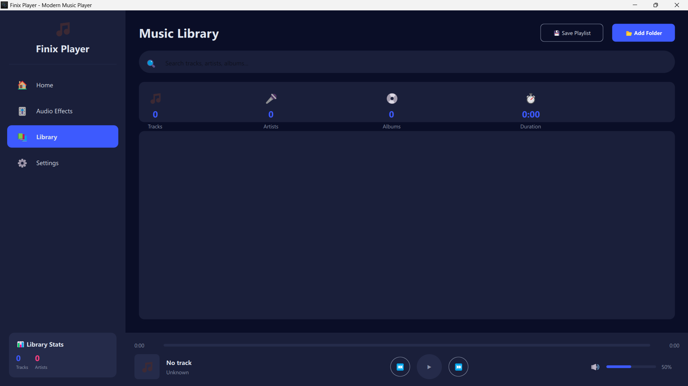

# 🎵 Finix Player

<div align="center">


**A Modern, Feature-Rich Audio Player Built with Qt 6 and C++17**

[](https://www.qt.io/)
[](https://isocpp.org/)
[](LICENSE)
[]()

[Features](#-features) • [Screenshots](#-screenshots) • [Installation](#-installation) • [Usage](#-usage) • [Documentation](#-documentation) • [Developer](#-developer)

</div>

---

## 📖 Overview

Finix Player is a sophisticated music player application that demonstrates advanced C++ programming concepts and modern Qt development practices. Built with Qt 6.10 and C++17, it combines powerful audio playback capabilities with an elegant, user-friendly interface.

### Why Finix Player?

- 🎨 **Modern Dark-Themed UI** - Sleek interface inspired by contemporary music players
- 🎚️ **Real-Time Audio Effects** - Professional-grade audio processing capabilities
- 📚 **Smart Music Library** - Intelligent organization with metadata scanning
- 🎬 **YouTube Integration** - Stream audio directly from YouTube
- 🎵 **Multiple Format Support** - MP3, FLAC, OGG, WAV, M4A, AAC
- 🔧 **Extensible Architecture** - Clean OOP design with design patterns

---

## ✨ Features

### 🎵 Audio Playback
- **Multi-Format Support**: MP3, FLAC, OGG, WAV, M4A, AAC
- **YouTube Streaming**: Direct audio playback from YouTube with search
- **Queue Management**: Circular buffer-based track queue
- **Library Playback**: Sequential playback through entire music library
- **Smart Previous/Next**: Intelligent track navigation with 3-second threshold

### 🎚️ Real-Time Audio Effects
- **Volume Gain Boost**: Amplify audio beyond 100% (0.0x - 2.0x)
- **Stereo Balance**: Left/Right channel balance adjustment (-1.0 to 1.0)
- **Playback Speed**: Variable speed control (0.25x - 2.0x)
- **Fade In Effect**: Smooth volume fade on playback start
- **Effect Presets**: One-click reset to default settings

### 📚 Music Library Management
- **Automatic Scanning**: Recursive directory scanning with progress tracking
- **Metadata Extraction**: Automatic title, artist, album, genre detection
- **Smart Search**: Real-time filtering across all metadata fields
- **Statistics Dashboard**: Track count, artists, albums, total duration
- **LRU Cache**: Optimized album art caching for performance
- **Playlist Export**: Save library as M3U playlist

### 🎨 User Interface
- **Modern Dark Theme**: Professional color scheme with smooth animations
- **Responsive Design**: Adaptive layout with minimum size constraints
- **Keyboard Shortcuts**: Full keyboard control support
- **Visual Feedback**: Real-time playback state indicators
- **Album Art Display**: Thumbnail and full-size artwork support

---

## 🖼️ Screenshots

<div align="center">

### Home Screen

*Modern interface with now playing display*

### Audio Effects Panel

*Professional-grade real-time audio effects*

### Music Library

*Organized library with smart search and filtering*

### Settings Page

*Comprehensive settings and keyboard shortcuts*

</div>

---

## 🚀 Installation

### Prerequisites

- **Qt Framework**: 6.10 or higher
- **Compiler**: C++17 compatible (GCC 7+, Clang 5+, MSVC 2017+)
- **CMake**: 3.22 or higher
- **yt-dlp** (Optional): For YouTube streaming functionality

### Qt Student Offer

This project was developed using **Qt for Education**, provided free to students through Qt's academic program. Special thanks to the Qt Company for supporting student developers and making professional-grade development tools accessible to learners.

> 🎓 **Students**: Get your free Qt license at [https://www.qt.io/qt-for-education](https://www.qt.io/qt-for-education)

### Building from Source

#### Clone the Repository
```bash
git clone https://github.com/yourusername/finix-player.git
cd finix-player
```

#### Build with CMake
```bash
mkdir build
cd build
cmake ..
cmake --build . --config Release
```

#### Run the Application
```bash
# Windows
./FinixPlayer.exe

# Linux/macOS
./FinixPlayer
```

### Optional: YouTube Support

To enable YouTube streaming, download yt-dlp and place it in the application directory:

```bash
# Windows
curl -L https://github.com/yt-dlp/yt-dlp/releases/latest/download/yt-dlp.exe -o yt-dlp.exe

# Linux/macOS
curl -L https://github.com/yt-dlp/yt-dlp/releases/latest/download/yt-dlp -o yt-dlp
chmod +x yt-dlp
```

---

## 📚 Usage

### Basic Controls

| Action | Shortcut | Description |
|--------|----------|-------------|
| Play/Pause | `Space` | Toggle playback |
| Open File | `Ctrl+O` | Open audio file dialog |
| Open Library | `Ctrl+L` | Navigate to library view |
| Volume Up | `↑` | Increase volume by 5% |
| Volume Down | `↓` | Decrease volume by 5% |

### Playing Music

#### Local Files
1. Click **Open File** or press `Ctrl+O`
2. Select an audio file (MP3, FLAC, OGG, WAV, M4A, AAC)
3. Playback starts automatically

#### YouTube Streaming
1. Click **YouTube** button
2. Enter song name or YouTube URL
3. Wait for audio stream to load
4. Playback starts automatically

#### Library Playback
1. Click **Add Folder** in Library view
2. Select your music directory
3. Wait for scanning to complete
4. Double-click any track to start library playback mode
5. Use Previous/Next buttons to navigate

### Audio Effects

Navigate to **Audio Effects** page to access:

- **Gain Boost**: Drag slider or enter percentage (50% - 200%)
- **Balance**: Adjust left/right balance (-100% to +100%)
- **Playback Speed**: Select preset or use slider (0.25x - 2.0x)
- **Fade In**: Toggle smooth volume fade on playback start
- **Reset All**: One-click return to default settings

---

## 🏗️ Architecture

### Design Patterns Used

- **Singleton Pattern**: `MusicLibrary` - Single instance for library management
- **Factory Pattern**: Audio effect creation and management
- **Observer Pattern**: Qt Signals/Slots for event handling
- **Template Pattern**: Generic audio processing utilities
- **Strategy Pattern**: Pluggable audio effect chain

### Key Components

```
FinixPlayer/
├── AudioController      # Main playback controller
├── Track               # Audio track metadata and operations
├── MusicLibrary        # Singleton library manager
├── LibraryModel        # Qt Model for QML integration
├── Playlist            # Playlist management
├── PlaylistManager     # Friend class for playlist operations
├── CircularBuffer      # Template-based queue implementation
├── LRUCache           # Template-based caching system
├── AudioEffect        # Base class for audio effects
├── EqualizerEffect    # 10-band equalizer implementation
├── ReverbEffect       # Reverb audio effect
└── BassBoostEffect    # Bass enhancement effect
```

## 📋 Technical Specifications

### System Requirements

- **OS**: Windows 10/11, Linux (Ubuntu 20.04+), macOS 10.15+
- **RAM**: 4 GB minimum, 8 GB recommended
- **Storage**: 100 MB for application, additional space for music library
- **Audio**: DirectSound (Windows) / ALSA/PulseAudio (Linux) / CoreAudio (macOS)

### Supported Audio Formats

| Format | Extension | Codec | Quality |
|--------|-----------|-------|---------|
| MP3 | `.mp3` | MPEG-1/2 Layer 3 | Lossy |
| FLAC | `.flac` | Free Lossless Audio Codec | Lossless |
| OGG | `.ogg` | Vorbis | Lossy |
| WAV | `.wav` | PCM | Uncompressed |
| M4A | `.m4a` | AAC | Lossy |
| AAC | `.aac` | Advanced Audio Coding | Lossy |

### Performance Metrics

- **Library Scan Speed**: ~1000 tracks/second (SSD)
- **Memory Usage**: ~50 MB base, +20 MB per 1000 tracks
- **Audio Latency**: <10ms on modern hardware
- **Effect Processing**: Real-time (50ms update interval)

---

## 🛠️ Development

### Project Structure

```
Finix/
├── CMakeLists.txt          # Build configuration
├── main.cpp                # Application entry point
├── main.qml                # Main QML interface
├── AudioController.h/cpp   # Audio playback controller
├── Track.h/cpp             # Track metadata management
├── Playlist.h/cpp          # Playlist operations
├── MusicLibrary.h/cpp      # Library management
├── LibraryModel.h/cpp      # QML data model
├── PlaylistManager.h/cpp   # Playlist friend class
├── AudioEffect.h/cpp       # Audio effects system
├── AudioException.h        # Exception hierarchy
├── AudioUtils.h            # Template utilities
├── CircularBuffer.h        # Queue implementation
├── Cache.h                 # LRU cache template
├── resources.qrc           # Qt resources
└── assests/                # Application assets
    ├── app_icon.ico
    ├── app_icon_full.png
    └── default.jpg
```

### Building for Development

```bash
# Debug build with verbose output
cmake -DCMAKE_BUILD_TYPE=Debug ..
cmake --build . --config Debug --verbose

# Enable all warnings
cmake -DCMAKE_CXX_FLAGS="-Wall -Wextra -Wpedantic" ..
```

### Code Style

- **Naming Convention**: 
  - Classes: `PascalCase`
  - Functions: `camelCase`
  - Members: `m_camelCase`
  - Static: `s_camelCase`
- **Indentation**: 4 spaces
- **Line Length**: 100 characters maximum
- **Comments**: Doxygen-style for public APIs

---

## 🧪 Testing

### Manual Testing Checklist

- [ ] Local file playback (all formats)
- [ ] YouTube streaming
- [ ] Library scanning (small/large directories)
- [ ] Audio effects (all parameters)
- [ ] Previous/Next navigation
- [ ] Volume control
- [ ] Seek functionality
- [ ] Playlist export
- [ ] Keyboard shortcuts

### Known Issues

- YouTube streaming requires active internet connection
- Large libraries (10,000+ tracks) may have initial scan delay
- Playback rate adjustment affects pitch (inherent in Qt Multimedia)

---


### Development Guidelines

- Follow the existing code style
- Add comments for complex logic
- Update documentation for new features
- Test on multiple platforms if possible

---

## 📄 License

This software is released into the **public domain** under the Unlicense.

Anyone is free to copy, modify, publish, use, compile, sell, or distribute this software, either in source code form or as a compiled binary, for any purpose, commercial or non-commercial, and by any means.

See [LICENSE](LICENSE) file for full details.

---

## 👨‍💻 Developer

<div align="center">

### **Kazi MD. Sayed Hossain**

🎓 Computer Science Student | 🎵 Audio Enthusiast | 💻 Qt Developer

[](mailto:kazimdsayedhossain@outlook.com)
[](https://www.google.com/maps/place/Khulna)

</div>

### About the Developer

Passionate about creating intuitive and powerful software solutions. Specializes in C++ development, Qt framework, and audio processing applications.

### Development Journey

Finix Player was developed as an educational project to explore:
- Advanced C++ programming techniques
- Qt 6 framework capabilities
- Real-time audio processing
- Modern UI/UX design principles
- Software architecture patterns

---

## 🙏 Acknowledgments

### Special Thanks

- **The Qt Company** - For providing the Qt Framework for Education program, making professional-grade development tools accessible to students worldwide. This project would not have been possible without their generous academic licensing program.

- **Qt Community** - For extensive documentation, tutorials, and forum support that guided the development process.

- **yt-dlp Contributors** - For the excellent YouTube download tool that powers the streaming functionality.

- **C++ Standards Committee** - For continuing to evolve the C++ language with modern features that make development more efficient and enjoyable.

### Technologies Used

- [Qt 6.10](https://www.qt.io/) - Cross-platform application framework
- [Qt Multimedia](https://doc.qt.io/qt-6/qtmultimedia-index.html) - Audio/video playback
- [Qt Quick](https://doc.qt.io/qt-6/qtquick-index.html) - Modern declarative UI
- [CMake](https://cmake.org/) - Build system
- [yt-dlp](https://github.com/yt-dlp/yt-dlp) - YouTube streaming support

---

## 📞 Contact & Support

### Get in Touch

- **Email**: [kazimdsayedhossain@outlook.com](mailto:kazimdsayedhossain@outlook.com)
- **Project Issues**: [GitHub Issues](https://github.com/kazimdsayedhossain/finix-player/issues)

### Support the Project

If you find Finix Player useful, please consider:
- ⭐ Starring the repository
- 🐛 Reporting bugs and issues
- 💡 Suggesting new features
- 🔀 Contributing code improvements
- 📢 Sharing with other developers

---

## 🗺️ Roadmap

### Version 1.1 (Planned)
- [ ] Equalizer with visual frequency display
- [ ] Custom playlist management
- [ ] Last.fm scrobbling integration
- [ ] Cross-fade between tracks
- [ ] Mini player mode

### Version 1.2 (Future)
- [ ] Plugin system for audio effects
- [ ] Visualization support
- [ ] Online radio streaming
- [ ] Mobile companion app
- [ ] Cloud library sync

---

<div align="center">


Copyright © 2025 Kazi MD. Sayed Hossain

[⬆ Back to Top](#-finix-player)

</div>
